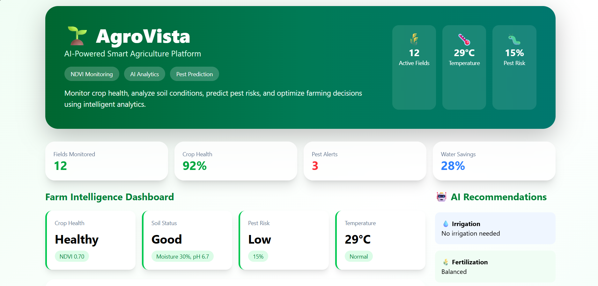
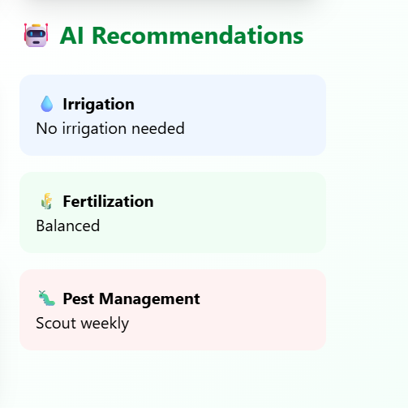
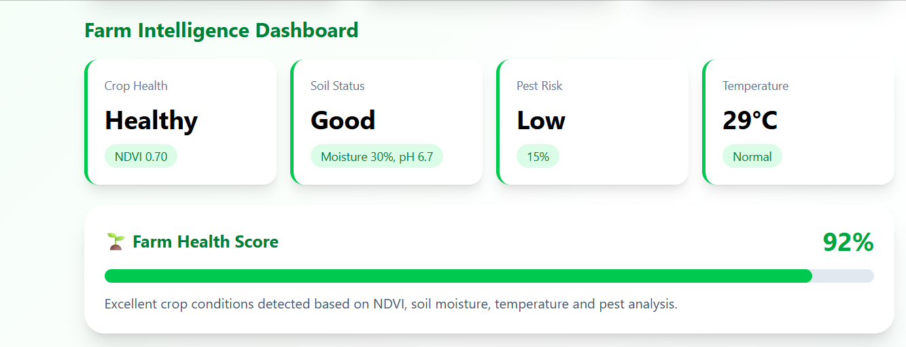
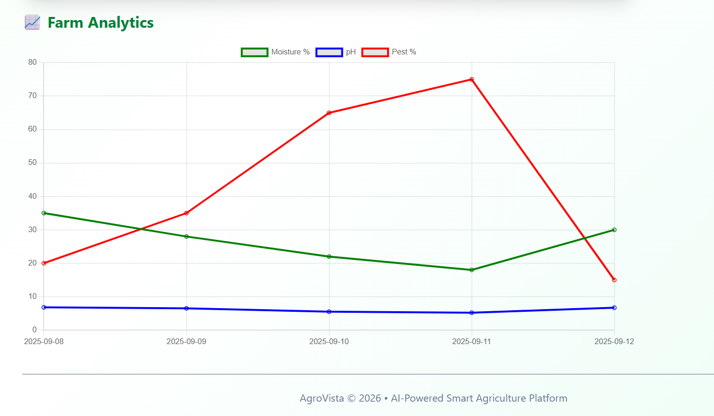

# 🌱 AgroVista

### AI-Powered Smart Agriculture Intelligence Platform

AgroVista is a full-stack smart agriculture platform that combines data analytics, crop health monitoring, pest-risk prediction, and AI-driven recommendations to help farmers make informed decisions.

The platform analyzes farm conditions, visualizes key agricultural metrics, and generates actionable insights for irrigation, fertilization, and pest management.

---

## 🚀 Problem Statement

Traditional farming often relies on manual observation and reactive decision-making.

Farmers face challenges such as:

* Crop diseases
* Pest infestations
* Inefficient irrigation
* Soil degradation
* Resource wastage

AgroVista addresses these challenges by providing a centralized intelligence dashboard that converts agricultural data into actionable recommendations.

---

## ✨ Key Features

### 📊 Precision Agriculture Dashboard

* Crop health monitoring
* Soil condition analysis
* Weather tracking
* Pest-risk assessment
* Farm performance visualization

### 🤖 AI Recommendation Engine

Provides intelligent recommendations for:

* Irrigation scheduling
* Fertilizer management
* Pest control strategies

### 📈 Trend Analytics

Interactive charts for:

* Soil moisture
* pH levels
* Pest probability
* Historical farm trends

### 🌱 Farm Health Score

Real-time health scoring system based on:

* NDVI indicators
* Soil metrics
* Environmental conditions
* Pest analysis

---

## 🏗 System Architecture

```text
Farmer Data
      │
      ▼
 Flask Backend API
      │
      ▼
Data Processing Layer
      │
      ├── Crop Health Analysis
      ├── Soil Analysis
      ├── Pest Prediction
      └── Recommendation Engine
      │
      ▼
 React Dashboard
      │
      ▼
 Interactive Insights & Visualizations
```

---

## 🛠 Tech Stack

### Frontend

* React.js
* Tailwind CSS
* Chart.js
* Axios

### Backend

* Flask
* Python

### Data Processing

* NumPy
* Pandas

### Visualization

* React Chart.js 2

### Version Control

* Git
* GitHub

---
## 📸 Screenshots

### Dashboard Overview



### AI Recommendation Engine



### Analytics View




---

🚀 Live Demo
AgroVista Deployment

🌐 Application URL: https://agrovista-phi.vercel.app

Explore the live platform to experience:

📊 Interactive Agriculture Analytics Dashboard
🌱 Crop Health Monitoring
🤖 AI Recommendation Engine
🐛 Pest Risk Intelligence
💧 Smart Irrigation Insights
📈 Trend Visualization & Reporting

The live deployment showcases a production-ready implementation of a smart agriculture intelligence platform built using React, Tailwind CSS, Flask, and data analytics technologies.


## 🎯 Business Impact

AgroVista helps farmers:

* Improve crop productivity
* Reduce water consumption
* Detect risks early
* Optimize fertilizer usage
* Increase operational efficiency

---

## 🔍 Example Insights

```text
Crop Health: Healthy
Soil Status: Good
Temperature: 29°C
Pest Risk: Low

Recommendation:
✓ No irrigation needed
✓ Balanced fertilization
✓ Weekly pest scouting
```

---

## ⚙ Installation

### Clone Repository

```bash
git clone https://github.com/your-username/agrovista.git
```

### Frontend Setup

```bash
cd frontend
npm install
npm run dev
```

### Backend Setup

```bash
cd backend
pip install -r requirements.txt
python app.py
```

---

## 📌 Future Scope

* Satellite imagery integration
* Real-time IoT sensor connectivity
* Machine Learning crop disease prediction
* Weather forecasting integration
* Multi-farm management system
* Mobile application support
* Generative AI farming assistant

---

## 👨‍💻 Author

**Jeyanthan Petchimuthu**

AI • Machine Learning • Full Stack Development • Generative AI

LinkedIn: www.linkedin.com/in/jeyanthan-petchimuthu-777ba6329

GitHub: https://github.com/Jeyceo21

---

## ⭐ Project Highlights

* Full Stack Development
* AI-Powered Recommendations
* Data Visualization
* Agricultural Analytics
* Dashboard Engineering
* Real-World Problem Solving

AgroVista demonstrates the application of AI and analytics in precision agriculture to support smarter, data-driven farming decisions.
