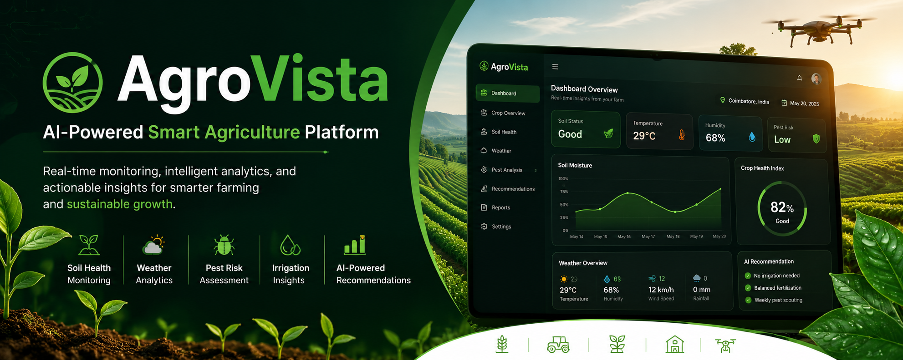
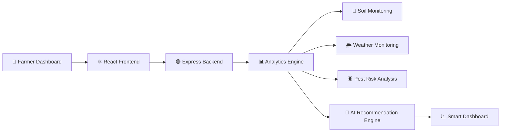
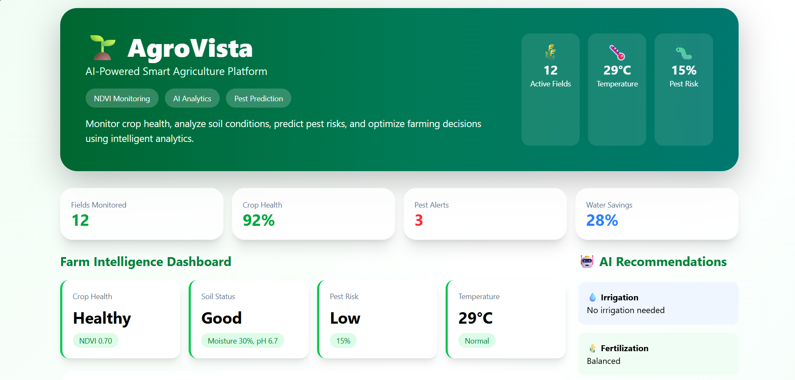
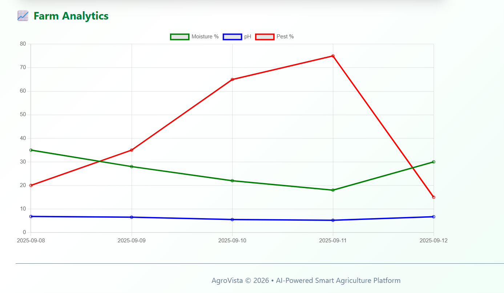
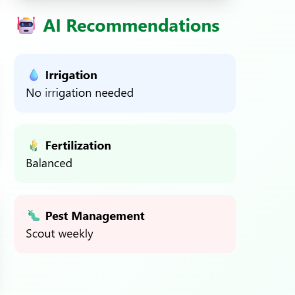

<p align="center">



</p>

<h1 align="center">

🌱 AgroVista

</h1>

<h3 align="center">

AI-Powered Smart Agriculture Monitoring & Analytics Platform

</h3>

<p align="center">

Modern Agriculture • Artificial Intelligence • Data Analytics • Precision Farming

</p>

<p align="center">


</p>

---

# 📖 Overview

AgroVista is an AI-powered smart agriculture platform designed to help farmers and agricultural organizations monitor crop conditions, soil health, weather parameters, and pest risks through an intuitive analytics dashboard.

The platform combines real-time environmental data, intelligent recommendations, and interactive visualizations to support precision farming and data-driven agricultural decision-making.

---

# 🎯 Problem Statement

Modern farming requires continuous monitoring of environmental conditions, crop health, and soil quality.

Traditional methods often rely on manual observations, making it difficult to identify risks early and optimize resource usage.

AgroVista addresses these challenges through a centralized AI-powered dashboard that provides actionable agricultural insights.

---

# ✨ Features

- 🌱 Soil Health Monitoring
- 🌦 Weather Analytics
- 📊 Interactive Dashboard
- 🪲 Pest Risk Analysis
- 💧 Irrigation Recommendations
- 🌾 Crop Health Monitoring
- 📈 Real-Time Data Visualization
- 🤖 AI-powered Farming Recommendations
- 📱 Responsive Interface
- ⚡ Modular Architecture

---

# 🛠 Technology Stack

| Category | Technologies |
|------------|--------------|
| Frontend | React, Vite |
| Backend | Node.js, Express |
| Charts | Chart.js |
| Styling | CSS |
| Language | JavaScript |
| AI | Rule-based Recommendation Engine |

---
---

# 🏗️ System Architecture


```mermaid
flowchart LR

A[🌾 Farmer Dashboard] --> B[⚛️ React Frontend]

B --> C[🟢 Express Backend]

C --> D[📊 Analytics Engine]

D --> E[🌱 Soil Monitoring]

D --> F[🌦 Weather Monitoring]

D --> G[🪲 Pest Risk Analysis]

D --> H[🤖 AI Recommendation Engine]

H --> I[📈 Smart Dashboard]
```

---

# 📸 Dashboard Preview

> Replace these placeholders with actual screenshots from your application.

## 🏠 Dashboard

<p align="center">



</p>

---

## 🌱 Crop Analytics

<p align="center">



</p>

---

## 🤖 AI Recommendation Panel

<p align="center">



</p>
---

# 🎥 Demo

<p align="center">


</p>

---

# ⚙️ Technology Overview

| Layer | Technology |
|--------|------------|
| Frontend | React + Vite |
| Backend | Node.js + Express |
| Charts | Chart.js |
| Styling | CSS |
| Data Processing | JavaScript |
| AI Engine | Rule-based Recommendation System |

---

# 📂 Project Structure

```text
AgroVista/

├── frontend/
│   ├── src/
│   ├── public/
│   └── package.json
│
├── server/
│   ├── index.js
│   ├── routes/
│   ├── controllers/
│   └── package.json
│
├── assets/
│   ├── banner.png
│   ├── dashboard.png
│   ├── crop-analysis.png
│   ├── recommendation.png
│   └── demo.gif
│
└── README.md
```

---

# 🚀 Installation

## Clone Repository

```bash
git clone https://github.com/Jeyceo21/AgroVista.git
```

---

## Install Frontend

```bash
cd frontend

npm install

npm run dev
```

---

## Install Backend

```bash
cd server

npm install

npm start
```

---

# 💻 Usage

1. Start the backend server.

2. Launch the React frontend.

3. Open the dashboard.

4. Monitor crop conditions.

5. Analyze soil health.

6. Review weather information.

7. Receive AI-powered recommendations.

---

# 🌾 AI Recommendation Pipeline

```text
Sensor Data

      │

      ▼

Data Processing

      │

      ▼

Crop Analytics

      │

      ▼

Risk Assessment

      │

      ▼

AI Recommendation Engine

      │

      ▼

Farmer Dashboard
```

---

# 🌍 Use Cases

- Precision Agriculture

- Smart Irrigation

- Crop Monitoring

- Pest Risk Assessment

- Soil Health Analysis

- Farm Analytics

- Sustainable Farming

- Agricultural Decision Support

---
---

# 🗺️ Roadmap

### ✅ Phase 1 — Completed

- [x] Smart Agriculture Dashboard
- [x] Crop Health Monitoring
- [x] Soil Health Analytics
- [x] Weather Monitoring
- [x] Pest Risk Analysis
- [x] AI-powered Recommendations

---

### 🚀 Phase 2 — Planned

- [ ] Real-time IoT Sensor Integration
- [ ] Satellite Image Monitoring
- [ ] Machine Learning Crop Disease Detection
- [ ] Weather Forecast API
- [ ] Push Notifications

---

### 🌍 Phase 3 — Future Vision

- [ ] Mobile Application
- [ ] Multi-Farm Management
- [ ] Farmer Community Portal
- [ ] AI Chat Assistant
- [ ] Cloud Deployment
- [ ] Role-Based User Authentication

---

# 🤝 Contributing

Contributions are welcome.

If you'd like to improve AgroVista:

1. Fork the repository.
2. Create a new feature branch.
3. Commit your changes.
4. Push your branch.
5. Open a Pull Request.

Please ensure that your code is clean, well documented, and follows the project's coding standards.

---

# 👨‍💻 Author

## Jeyanthan Petchimuthu

AI Engineer • Machine Learning Engineer • Full Stack Developer

🎓 B.Tech Computer Science Engineering

NIIT University

### Connect with me

- 🐙 GitHub: https://github.com/Jeyceo21
- 💼 LinkedIn: https://www.linkedin.com/in/jeyanthan-petchimuthu-777ba6329/
- 📧 Email: jeyanthanpetchimuthu@gmail.com

---

---

# 📬 Contact

Interested in collaborating on AI, Machine Learning, or Full Stack projects?

Feel free to connect for:

- Artificial Intelligence
- Machine Learning
- Smart Agriculture
- Full Stack Development
- Open Source Collaboration
- Internship Opportunities
- Technical Discussions

### Connect with Me

- 🐙 GitHub: https://github.com/Jeyceo21
- 💼 LinkedIn: https://www.linkedin.com/in/jeyanthan-petchimuthu-777ba6329/
- 📧 Email: jeyanthanpetchimuthu@gmail.com

---

# 📜 License

This project is licensed under the **MIT License**.

You are free to use, modify, and distribute this project under the terms of the MIT License.

For more details, see the **LICENSE** file.

---

# ⭐ Support

If you found **AgroVista** useful, please consider giving this repository a ⭐.

Your support helps improve the project, encourages future development, and makes it easier for others to discover it.

---

<p align="center">

## 🌱 AgroVista

### AI-Powered Smart Agriculture Monitoring & Analytics Platform

Built with

**React • Node.js • Express • Chart.js • JavaScript**

</p>

---

<p align="center">

### Designed & Developed by

## Jeyanthan Petchimuthu

**AI Engineer • Machine Learning Engineer • Full Stack Developer**

</p>

<p align="center">

Thank you for visiting this repository.

If you found this project valuable, consider giving it a ⭐ and connecting with me on LinkedIn.

</p>
